# Alpixa

**Windows ve macOS için toplu e-posta gönderim masaüstü uygulaması**

---

## İçindekiler

1. [Bu uygulama nedir?](#1-bu-uygulama-nedir)
2. [Hızlı başlangıç (5 dakikada ilk gönderim)](#2-hızlı-başlangıç-5-dakikada-ilk-gönderim)
3. [Kurulumdan önce hazırlanması gerekenler](#3-kurulumdan-önce-hazırlanması-gerekenler)
4. [Kurulum](#4-kurulum)
5. [İlk çalıştırma ve kurulum sihirbazı](#5-ilk-çalıştırma-ve-kurulum-sihirbazı)
6. [DNS kayıtları rehberi](#6-dns-kayıtları-rehberi)
7. [E-posta hesabı bağlama](#7-e-posta-hesabı-bağlama)
8. [Liste hazırlama](#8-liste-hazırlama)
9. [İlk kampanya](#9-ilk-kampanya)
10. [Isınma planı](#10-isınma-planı)
11. [Spama düşmemek için kontrol listesi](#11-spama-düşmemek-için-kontrol-listesi)
12. [Kurulum sonrası izleme](#12-kurulum-sonrası-izleme)
13. [Sık sorulan sorular](#13-sık-sorulan-sorular)
14. [Sorun giderme](#14-sorun-giderme)
15. [Sözlük](#15-sözlük)
16. [Geliştiriciler için](#16-geliştiriciler-için)

---

## 1. Bu uygulama nedir?

Alpixa, bilgisayarınızda çalışan bir **masaüstü uygulamasıdır**. Web sitesi veya telefon uygulaması değildir; çift tıklayarak açılır.

Verdiğiniz listedeki kişilere, her birine **ayrı** bir e-posta gönderir. Liste boyutunda sınır yoktur. Gönderimi **Sıralı** (tek tek, aralarda birkaç saniye bekleyerek) veya **Toplu** (aynı anda birkaç bağlantı ile, hız sınırları içinde) yapabilirsiniz.

Temel amacı, e-postalarınızın **spam klasörüne değil gelen kutusuna** ulaşmasıdır. Bunun için gönderim hızını kontrol eder, alan adınızın DNS ayarlarını denetler, listenizi temizler, abonelikten çıkanları ve ulaşmayan adresleri otomatik olarak listeden çıkarır.

Kurulum için ek program yüklemeniz veya komut satırı kullanmaniz gerekmez. Tüm veriler kendi bilgisayarınızda durur.

> **Önemli not:** Hiçbir uygulama "spama hiç düşmez" garantisi veremez. Sonucu belirleyen en önemli üç şey şunlardır:
> 1. Alan adınızın doğru ayarlanması (SPF, DKIM, DMARC)
> 2. Listenizdeki kişilerin sizden e-posta almayı kabul etmiş olması
> 3. Yavaş başlayıp hacmi kademeli artırmak
>
> Alpixa bu üç konuda size rehberlik eder ve alan adınızda kırmızı (düzeltilmesi gereken) bir sorun varken gönderim yapmanızı engeller. Bu engeli sadece bilinçli bir onayla ("Riskleri anlıyorum, yine de gönder") aşabilirsiniz.

---

## 2. Hızlı başlangıç (5 dakikada ilk gönderim)

Alan adınız ve e-posta hesabınız hazırsa:

1. Kurulum dosyasını indirin ve çift tıklayın. ([Bölüm 4](#4-kurulum))
2. Alpixa'yı açın. **Kurulum sihirbazı** otomatik başlar.
3. Dili seçin, **İleri**'ye basın.
4. E-posta hesabınızı ekleyin ve **Bağlantıyı test et** butonuna basın. ([Bölüm 7](#7-e-posta-hesabı-bağlama))
5. **Alan adı kontrolü** adımında maddelerin yeşil olduğunu görün. Kırmızı varsa [Bölüm 6](#6-dns-kayıtları-rehberi)'ya bakın.
6. **Deneme gönderimi** adımında kendi adreslerinizi yazıp **Test gönder**'e basın.
7. E-postaların gelen kutusuna düştüğünü kontrol edin ve **Bitir**'e basın.

Hazırsınız. Gerçek listenizi [Bölüm 8](#8-liste-hazırlama)'e göre içe aktarın, sonra [Bölüm 9](#9-ilk-kampanya)'daki gibi ilk kampanyanızı başlatın.

---

## 3. Kurulumdan önce hazırlanması gerekenler

Bu bölüm, uygulamadan bağımsız ama **spama düşmemek için en kritik** hazırlıkları anlatır. Lütfen atlamayın.

### 3.1 Bilgisayar

| İşletim sistemi | Minimum sürüm |
|---|---|
| Windows | Windows 10 (1809 veya üstü) ya da Windows 11, 64-bit |
| macOS | macOS 14 Sonoma veya üstü (Intel ve Apple Silicon) |

Başka bir program (.NET, Python, veritabanı vb.) yüklemenize **gerek yoktur**. Gerekli her şey kurulum paketinin içindedir.

### 3.2 Kendi alan adınız

**Ne?** `firmaniz.com` gibi size ait bir internet adresi.

**Neden gerekli?** Gmail veya Outlook, kişisel adreslerden (`ornek@gmail.com`) yapılan toplu gönderimleri hızla spama atar veya hesabı kapatır. Kendi alan adınız, kim olduğunuzu kanıtlamanızı sağlar. Alpixa, gönderen adresi `gmail.com`, `outlook.com`, `hotmail.com`, `yahoo.com` gibi kişisel bir adresse **Alan Adı Sağlığı** ekranında uyarı gösterir.

**Öneri:** Toplu gönderim için bir alt alan adı kullanın, örneğin `bulten.firmaniz.com`. Böylece bir sorun olursa ana alan adınız (günlük is e-postalarınız) etkilenmez.

### 3.3 DNS paneline erişim

**Ne?** Alan adınızı satın aldığınız veya yönettiğiniz firmanın (Cloudflare, GoDaddy, Natro, Turhost vb.) yönetim paneli.

**Neden gerekli?** SPF, DKIM ve DMARC kayıtlarını buraya eklemeniz gerekecek. Bu kayıtlar, e-postanın gerçekten sizden geldiğini alıcı sunuculara kanıtlar. Detaylar [Bölüm 6](#6-dns-kayıtları-rehberi)'da.

Erişiminiz yoksa BT ekibinizden veya alan adını yöneten kişiden yardım isteyin.

### 3.4 Gönderim hesabı

E-postalar bir sunucu üzerinden gönderilir. Üç seçenek vardır:

| Seçenek | Uygun olduğu durum | Artışı | Eksisi |
|---|---|---|---|
| **ESP** (Amazon SES, Brevo, Mailgun, SendGrid) | Yüzlerce / binlerce e-posta | Yüksek limit, iyi itibar, kolay DNS kurulumu | Ücretli olabilir |
| **Google Workspace / Microsoft 365** | Günde birkaç yüz e-posta | Zaten kullanıyorsanız ek maliyet yok | Günlük limitler düşük |
| **Kendi SMTP sunucunuz** | Deneyimli BT ekibi varsa | Tam kontrol | Temiz IP, PTR kaydı ve doğru ayar gerekir |

**Öneri:** Büyük listeler için bir ESP kullanın. Alpixa'da bu dört ESP için hazır ayar vardır; sağlayıcıyı seçtiğinizde sunucu adresi ve port otomatik dolar.

### 3.5 İzinli liste

**Bu en önemli maddedir.**

- Listenizdeki herkes sizden e-posta almayı **kabul etmiş** olmalı. Alpixa, liste içe aktarırken "Bu kişilerin açık rızası var" kutusunu işaretlemeden devam etmenize izin vermez.
- Satın alınmış, internetten toplanmış veya başka firmadan alınmış liste **kullanmayın**. Bu, spama düşmenin bir numaralı nedenidir.
- Türkiye'de ticari elektronik ileti gönderiyorsanız **IYS (İleti Yönetim Sistemi)** kaydı ve izin kontrolü yasal olarak gerekebilir. (Alpixa'da IYS için bir bağlantı noktası vardır ama bu sürümde hazır bir IYS entegrasyonu **yoktur**; bkz. [SSS](#13-sık-sorulan-sorular).)
- KVKK aydınlatma yükümlülüklerinizi yerine getirin. AB'deki alıcılar için GDPR geçerlidir.

---

## 4. Kurulum

Kurulum dosyaları GitHub'daki **Releases** (Sürümler) sayfasındadır: **https://github.com/nuwii/alpixa/releases/latest**

Sayfanın altındaki **Assets** bölümünde iki dosya bulunur:

| Dosya | Bilgisayar |
|---|---|
| `AlpixaSetup.exe` | Windows 10 / 11 (64 bit) |
| `Alpixa.dmg` | macOS 14 (Sonoma) ve üzeri, Apple Silicon ve Intel |

### 4.1 Windows

1. Releases sayfasından `AlpixaSetup.exe` dosyasını indirin.
2. Dosyaya çift tıklayın.
3. Windows "Windows kişisel bilgisayarınızı korudu / Bilinmeyen yayıncı" uyarısı gösterirse **Ek bilgi → Yine de çalıştır** seçin. (Kurulum dosyası dijital imza içermediği için bu uyarı normaldir.)
4. Kurulum adımlarını **İleri** diyerek tamamlayın. Yönetici (admin) yetkisi gerekmez; uygulama sadece sizin kullanıcı hesabınıza kurulur.
5. Başlat menüsünden veya masaüstü kısayolundan **Alpixa**'yı açın.

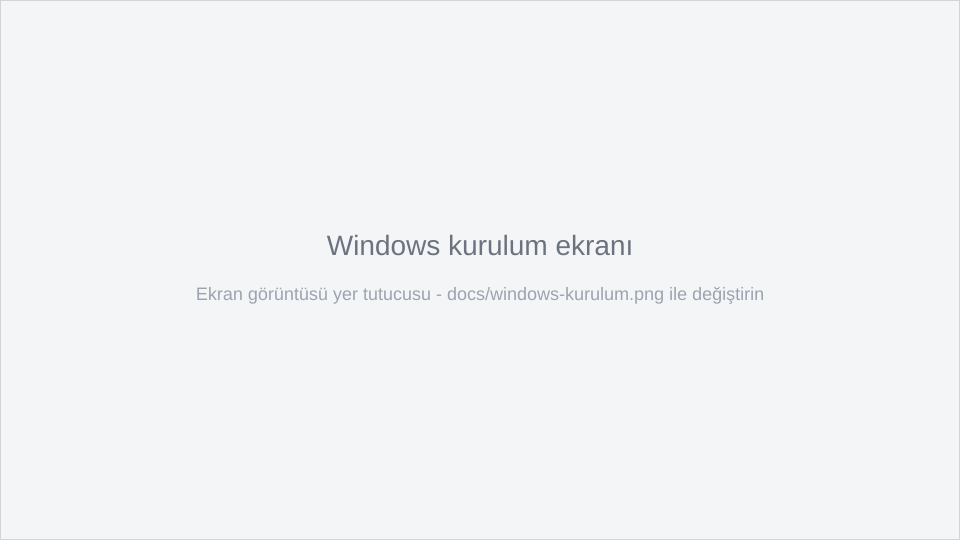

### 4.2 macOS

1. Releases sayfasından `Alpixa.dmg` dosyasını indirin.
2. Dosyaya çift tıklayın. Bir pencere açılır.
3. **Alpixa** simgesini **Applications** (Uygulamalar) klasörüne sürükleyin.
4. Uygulamalar klasöründe **Alpixa**'ya **sağ tıklayıp → Aç** deyin, çıkan uyarıda tekrar **Aç**'a basın. (Paket Apple Developer imzası taşımadığı için ilk açılışta bu gerekir; sonraki açılışlarda normal çift tıklama yeterlidir.)
   - macOS "Alpixa açılamadı" diyip **Aç** seçeneği sunmazsa: **Sistem Ayarları → Gizlilik ve Güvenlik** sayfasının altındaki **Yine de Aç** düğmesine basın.
5. macOS bildirim izni isterse **İzin ver** deyin; gönderim bitince bildirim alırsınız.

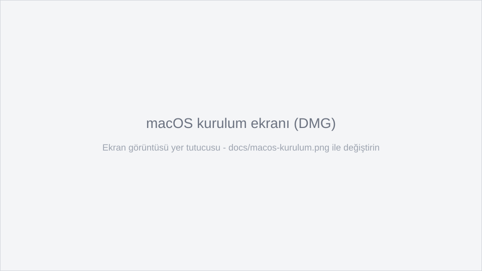

### 4.3 Kaldırma

- **Windows:** Ayarlar → Uygulamalar → Alpixa → Kaldır
- **macOS:** Uygulamalar klasöründeki Alpixa'yı Cop Kutusu'na sürükleyin

Verileriniz (listeler, raporlar) uygulamadan ayrı bir klasörde tutulur ve kaldırınca silinmez. Kaldırmadan önce **Ayarlar → Yedek al** ile yedekleyin. Veri klasörünün tam yolu **Ayarlar → Veri ve destek** bölümünde "Veri klasörü" satırında yazar.

---

## 5. İlk çalıştırma ve kurulum sihirbazı

Uygulama ilk açıldığında dört adımlı bir sihirbaz başlar:

| Adım | Ne yapılır | Açıklama |
|---|---|---|
| 1. Dil | Türkçe, English, Deutsch, Français, Español veya Русский seçilir | Dil değişikliği uygulamayı kapatıp açtığınızda geçerli olur. Sonradan **Ayarlar → Dil** ile değiştirilebilir. |
| 2. Gönderen hesabı | Sağlayıcı, gönderen adı/adresi, kullanıcı adı/şifre veya tarayıcı ile giriş | **İleri**'ye basınca bağlantı otomatik test edilir. Detay: [Bölüm 7](#7-e-posta-hesabı-bağlama) |
| 3. Alan adı kontrolü | SPF, DKIM, DMARC, MX ve kara liste kontrol edilir | Eksik kayıt varsa eklemeniz gereken örnek kaydı gösterir |
| 4. Deneme gönderimi | Kendi adreslerinize örnek e-posta gider | Konu: "Alpixa deneme e-postası". Gelen kutusuna düştüğünü kontrol edin |

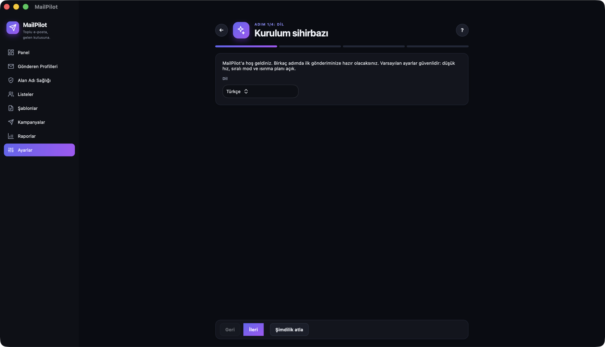

Sihirbazı **Şimdilik atla** ile geçebilirsiniz. Tekrar açmak için: **Ayarlar → Kurulum sihirbazını yeniden başlat**. Kurulum tamamlanmadıkça **Panel** ekranında hatırlatma görünür.

**Varsayılan ayarlar güvenlidir.** Hiçbir ayarı değiştirmeden gönderim yaparsanız uygulama sıralı modda (her e-posta arasında 3-8 saniye), ısınma planı açık ve hız sınırları düşük şekilde çalışır.

### Ekran düzeni

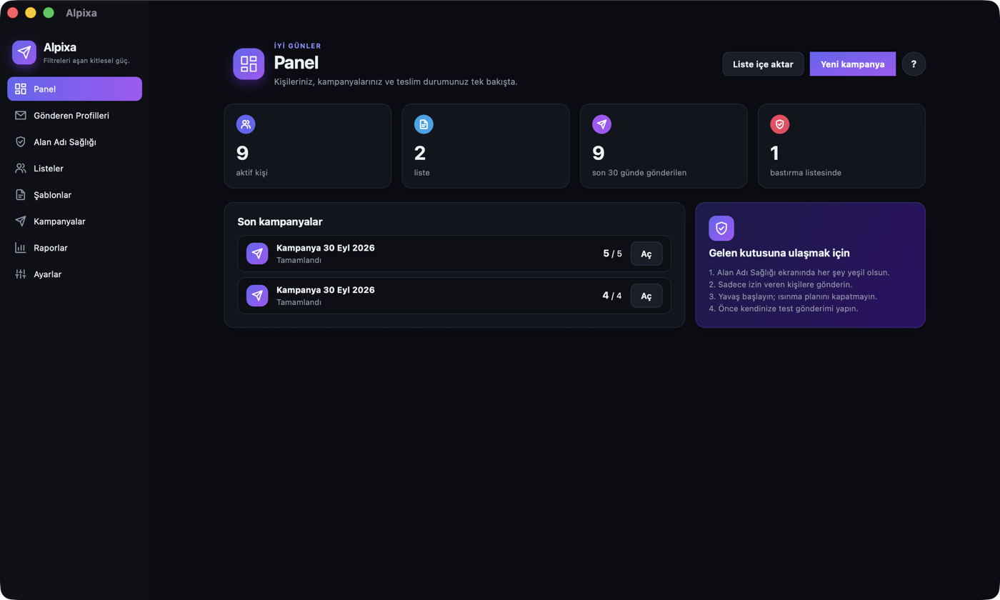

- Sol menü her zaman açıktır: **Panel, Gönderen Profilleri, Alan Adı Sağlığı, Listeler, Şablonlar, Kampanyalar, Raporlar, Ayarlar**. Seçili ekran renkli bir şeritle vurgulanır.
- Her ekranın üstünde ikonlu bir başlık, kısa bir açıklama ve o ekranın ana butonları bulunur. Sağ üstteki yuvarlak **?** butonu o ekranın yardımını açar; üst menüdeki **Yardım → Bu ekran için yardım** aynı işi yapar.
- Alt ekranlarda (profil düzenleme, liste detayı, şablon düzenleyici, sihirbazlar) başlığın solunda bir **←** geri butonu vardır.
- Her alanın ve butonun yanında küçük bir **i** ikonu vardır; göz yormaması için gizlidir ve fare o alanın, girdinin ya da butonun üzerine gelince dönerek belirir. Tıklayınca o alanın ne işe yaradığını ve değerini nereden bulacağınızı sade bir dille anlatan bir bilgi kartı açılır (örneğin "Port nedir, ne yazmalıyım?", "DKIM nedir?", "Uygulama şifresi nereden alınır?"). Kartı **Anladım** ile ya da dışına tıklayarak kapatabilirsiniz.
- Ekranlar açılırken içerik kartları sırayla, hafifçe yukarı kayarak belirir. Sihirbazlarda adımlar ileri giderken sağdan, geri giderken soldan kayar; üstteki adım çubuğu hangi adımda olduğunuzu gösterir.
- Kartların üzerine fareyle gelince hafifçe yükselirler; seçim kutuları macOS'ta sistemin açılır menüsüyle açılır.
- Klavye kısayolları (Windows'ta `Ctrl`, macOS'ta `Cmd`):

| Kısayol | İşlem |
|---|---|
| `Ctrl/Cmd + N` | Yeni kampanya |
| `Ctrl/Cmd + I` | Liste içe aktar |
| `Ctrl/Cmd + ,` | Ayarlar |

- Açık/koyu tema, işletim sisteminizin temasını otomatik izler.

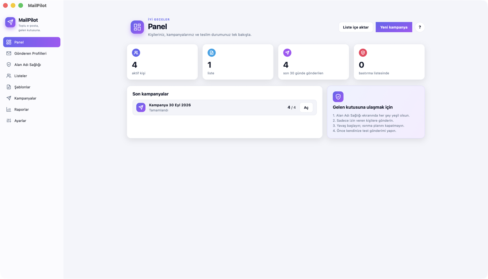
- Pencerenin boyutu ve konumu hatırlanır (en küçük boyut 1100x700).

---

## 6. DNS kayıtları rehberi

Bu kayıtlar, alıcı sunuculara "bu e-posta gerçekten bu alan adından geliyor" der. Eksik olursa e-postalarınız büyük olasılıkla spama düşer.

Alpixa'nın **Alan Adı Sağlığı** ekranı her maddeyi renkli gösterir:

| Renk | Anlamı |
|---|---|
| Yeşil (Geçti) | Sorun yok |
| Mavi (Bilgi) | Bilgi notu, örnek `p=none` DMARC politikası |
| Sarı (Uyarı) | Çalışır ama iyileştirilmeli |
| Kırmızı (Düzeltilmeli) | Gönderim engellenir |

Kırmızı maddelerde ne yapmanız gerektiği yazar ve eklemeniz gereken kayıt **Kopyala** butonuyla panoya alınabilir. Kontrol edilenler: SPF, DKIM, DMARC, MX, hizalama (alignment), alan adı kara listesi (Spamhaus DBL); kendi SMTP sunucunuzda ayrıca PTR (ters DNS) ve IP kara listeleri (Spamhaus ZEN, Barracuda, SpamCop).

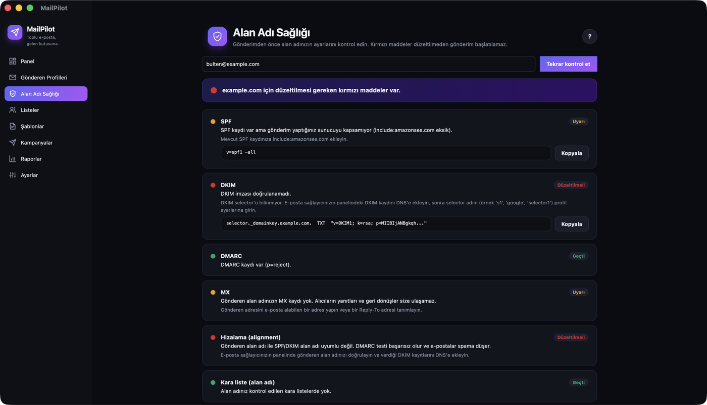

> Aşağıdaki değerler **örnektir**. Gerçek değerleri ESP'nizin veya e-posta sağlayıcınızın panelinden alın. Tüm örnekler `samples/dns-kayitlari.txt` dosyasında da vardır.

### 6.1 SPF

**Ne ise yarar?** Alan adınız adına hangi sunucuların e-posta gönderebileceğini belirtir.

| Alan | Değer |
|---|---|
| Tür | TXT |
| Ad | `@` (veya alt alan adı, örnek `bulten`) |
| Değer | `v=spf1 include:amazonses.com ~all` |

Kurallar (Alpixa bunları kontrol eder):
- Bir alan adında **sadece bir** SPF kaydı olmalı. Birden fazla sağlayıcı kullanıyorsanız tek kayıtta birleştirin: `v=spf1 include:amazonses.com include:_spf.google.com ~all`
- Toplam DNS sorgusu (`include`, `a`, `mx`, `redirect` vb.) 10'u geçmemeli. 8 ve üstü sarı uyarı verir.
- Kayıt `+all` ile bitmemeli.

### 6.2 DKIM

**Ne ise yarar?** E-postaya dijital imza ekler. Alıcı, e-postanın yolda değiştirilmediğini doğrular.

| Alan | Değer |
|---|---|
| Tür | TXT (ESP'lerde genelde CNAME) |
| Ad | `selector._domainkey` (örnek `mp1._domainkey`) |
| Değer | `v=DKIM1; k=rsa; p=MIIBIjANBgkqh...` (uzun bir anahtar) |

ESP kullanıyorsanız bu kaydı ESP size verir; genelde 2-3 adet CNAME kaydıdır. Alpixa'nın kaydı bulabilmesi için **selector** adını (örnek `s1`, `google`, `selector1`) profilde **DKIM selector** alanına girin. Selector boş bırakılırsa sağlayıcıya göre yaygın adlar denenir (Gmail `google`, Microsoft 365 `selector1`/`selector2`, SendGrid `s1`/`s2`, Mailgun, Brevo ve özel SMTP için birkaç yaygın ad). Amazon SES'in selector'lari tahmin edilemez; SES kullanıyorsanız selector'u mutlaka girin. Anahtar 1024 bit ise sarı uyarı, 1024'ten küçükse kırmızı gösterilir; 2048 bit önerilir.

### 6.3 DMARC

**Ne ise yarar?** SPF veya DKIM başarısız olursa alıcının ne yapacağını söyler. Ayrıca size rapor gönderilmesini sağlar. Gmail ve Yahoo toplu göndericilerden DMARC kaydı ister; kayıt yoksa Alpixa kırmızı gösterir.

| Alan | Değer |
|---|---|
| Tür | TXT |
| Ad | `_dmarc` |
| Değer | `v=DMARC1; p=none; rua=mailto:dmarc@firmaniz.com` |

Aşamalı geçiş:
1. İlk 2-4 hafta: `p=none` (sadece izle)
2. Sorun yoksa: `p=quarantine` (şüpheli olanı spama at)
3. Son aşama: `p=reject` (şüpheli olanı reddet)

### 6.4 Popüler panellerde nereye girilir?

| Panel | Yol |
|---|---|
| Cloudflare | Alan adı → DNS → Records → Add record |
| GoDaddy | My Products → Alan adı → DNS → Add New Record |
| Natro | Alan Adlarım → DNS Yönetimi → Kayıt Ekle |
| Turhost | Alan Adlarım → DNS Ayarları → Yeni Kayıt |

Panellerin menü adları zamanla değişebilir; bulamazsanız panelin yardım sayfasında "DNS kaydı ekleme" diye aratın.

Kayıtların aktif olması birkaç dakika ile 48 saat arası sürebilir. Sonra Alpixa'da **Tekrar kontrol et** butonuna basın.

### 6.5 PTR (sadece kendi sunucunuz varsa)

Kendi SMTP sunucunuzdan gönderiyorsanız, sunucu IP'sinin ters DNS (PTR) kaydı gönderen sunucu adını göstermeli ve o ad tekrar aynı IP'ye çözülmeli. Bunu hosting sağlayıcınız ayarlar. ESP kullanıyorsanız bu adımı atlayın (Alpixa bu kontrolü sadece "Özel SMTP" profillerinde yapar).

---

## 7. E-posta hesabı bağlama

**Gönderen Profilleri → Yeni profil** ekranından eklenir. Önce **Sağlayıcı** listesinden hesabınızın türünü seçin; sunucu adresi, port ve önerilen sınırlar otomatik dolar.

Her profilde doldurulacaklar:

| Alan | Açıklama |
|---|---|
| Profil adı | Sadece sizin için bir isim |
| Gönderen adı | Alıcının gördüğü isim, örnek "Firmaniz" |
| Gönderen adresi | Kendi alan adınızda olmalı, örnek `bulten@firmaniz.com` |
| Yanıt adresi (Reply-To) | İsteğe bağlı. Yanıtların gideceği adres |
| İletişim / posta adresi | E-postanın altında görünür (yasal gereklilik) |
| Gönderim sınırları | Günlük / saatlik / dakikalık |
| Isınma planı | Varsayılan açık. [Bölüm 10](#10-isınma-planı) |

Kaydetmeden önce **Bağlantıyı test et** butonuna basın. Hata olursa Alpixa ne olduğunu ve ne yapmanız gerektiğini sade dille yazar.

Şifreler bilgisayarınızın güvenli deposunda (Windows'ta DPAPI ile şifreli, macOS'ta Anahtar Zinciri) saklanır; düz metin olarak diske yazılmaz ve yedeğe dahil edilmez.

### 7.1 Gmail / Google Workspace

İki yol vardır:

**A) Uygulama şifresi (her kurulumda çalışır)**
1. Google hesabınızda 2 adımlı doğrulamayı açın.
2. Google hesabınızdan bir **Uygulama şifresi** oluşturun ([yardım](https://support.google.com/accounts/answer/185833)).
3. Alpixa'da sağlayıcı olarak **Gmail / Google Workspace** seçin.
4. **Tarayıcı yerine kullanıcı adı ve uygulama şifresi kullan** kutusunu işaretleyin.
5. Kullanıcı adı olarak Gmail adresinizi, şifre olarak 16 haneli uygulama şifresini girin (Google'ın gösterdiği boşluklar otomatik silinir). **Gönderen adresi** boş bırakılırsa kullanıcı adı kullanılır; **Gönderen adı**'nı doldurmayı unutmayın.
6. **Bağlantıyı test et**.

**B) Tarayıcı ile giriş (OAuth)**
1. Sağlayıcı olarak **Gmail / Google Workspace** seçin.
2. **Tarayıcı ile giriş yap** butonuna basın. Tarayıcı açılır.
3. Hesabınızı seçin ve izin verin, sonra uygulamaya geri dönün.
4. **Bağlantıyı test et**.

> Tarayıcı ile giriş için bir kez Google Cloud'da ücretsiz bir OAuth istemci kimliği oluşturup **Ayarlar → Tarayıcı ile giriş** bölümüne girmeniz gerekir; adım adım anlatım [Bölüm 16.7](#167-oauth-istemci-kimlikleri-gmail-ve-microsoft-365)'dedir. Tanımlı değilse Alpixa bunu söyler; o durumda A yolunu kullanın.

> Kişisel `@gmail.com` hesabı ile toplu gönderim önerilmez. Günlük limit düşüktür.

### 7.2 Microsoft 365 / Outlook

1. Sağlayıcı olarak **Microsoft 365 / Outlook** seçin.
2. **Tarayıcı ile giriş yap** butonuna basın ve izin verin.
3. **Bağlantıyı test et**.

> Microsoft, şifreyle SMTP girişini (Basic Auth) kapatmıştır. Bu yüzden tarayıcı üzerinden giriş gerekir. Bu da bir Microsoft (Entra ID) uygulama kaydı ve istemci kimliği gerektirir ([Bölüm 16.7](#167-oauth-istemci-kimlikleri-gmail-ve-microsoft-365)). Kurumsal hesaplarda yöneticinin posta kutusu için "SMTP AUTH" iznini açması gerekebilir.

### 7.3 ESP (Amazon SES, Brevo, Mailgun, SendGrid)

1. ESP panelinde alan adınızı doğrulayın (ESP size DNS kayıtlarını verir, [Bölüm 6](#6-dns-kayıtları-rehberi)).
2. ESP panelinden **SMTP kullanıcı adı ve şifresi** oluşturun (hesap şifreniz değil).
3. Alpixa'da sağlayıcıyı seçin, bilgileri yapıştırın.
4. Amazon SES için **Gelişmiş ayarları göster → SMTP sunucusu** bölümünde sunucu adresindeki bölgeyi kendi bölgenize göre düzeltin (varsayılan `email-smtp.eu-central-1.amazonaws.com`).
5. ESP'nin verdiği DKIM **selector**'unu **DKIM selector** alanına girin.
6. **Bağlantıyı test et**.

> Bu sürümde ESP'ler **SMTP** üzerinden kullanılır. ESP'lerin HTTP API'leri için kodda bir bağlantı noktası (`IMailTransport`) vardır ama hazır bir API entegrasyonu yoktur.

### 7.4 Özel SMTP

Sağlayıcı olarak **Özel SMTP** seçin. **Gelişmiş ayarları göster** işaretleyip sunucu adresi, port (genelde 587), güvenlik (`StartTls` port 587 için, `SslOnConnect` port 465 için), kullanıcı adı ve şifreyi girin.

Kendi sunucunuzdan DKIM imzasını Alpixa'nın atmasını istiyorsanız **DKIM** bölümünde selector, alan adı ve özel anahtar dosyasını (.pem) seçip **E-postaları Alpixa imzalasın** kutusunu işaretleyin.

### 7.5 Bounce takibi için IMAP (önerilir)

Profilde **Gelişmiş ayarları göster → Bounce ve abonelikten çıkış takibi (IMAP)** bölümünde **IMAP ile gelen kutusunu tara** kutusunu işaretleyip IMAP bilgilerini girin ve **IMAP bağlantısını test et**'e basın. Böylece uygulama her 15 dakikada bir:
- Ulaşmayan (bounce) e-postaları tespit eder (standart DSN raporları ve yaygın "Undelivered / Delivery Status" mesajları)
- Spam şikayeti raporlarını (ARF) okur
- E-posta ile gelen abonelikten çıkma isteklerini okur
- Bu adresleri otomatik olarak bastırma listesine alır

İlk taramada son 14 günün e-postalarına bakılır, sonra sadece yeni gelenlere. Hemen kontrol etmek için: **Ayarlar → Bounce ve çıkışları şimdi kontrol et**.

---

## 8. Liste hazırlama

### 8.1 Dosya formati

CSV (virgül veya noktalı virgül ile ayrılmış), TXT veya Excel (.xlsx) kullanabilirsiniz. Örnek dosya: `samples/ornek-liste.csv`

```csv
email,ad,soyad,firma,izin_kaynagi,izin_tarihi,sehir
ayse@ornek.com,Ayse,Yilmaz,ABC Ltd,web formu,2026-03-12,Izmir
mehmet@ornek.com,Mehmet,Kaya,XYZ AS,fuar,2026-05-02,Ankara
```

| Kolon | Zorunlu | Açıklama |
|---|---|---|
| email | Evet | Alıcı adresi. "e-posta", "eposta", "mail" gibi başlıklar da tanınır |
| ad, soyad | Hayır | Kişiselleştirme için (`Merhaba {{ ad }}`) |
| firma | Hayır | Kişiselleştirme için |
| izin_kaynagi | Önerilir | Kişinin izni nereden verdiği |
| izin_tarihi | Önerilir | İznin tarihi (örnek `2026-03-12` veya `12.03.2026`) |

Ek kolonlar da eklenebilir; şablonda `{{ kolon_adi }}` ile kullanılır (başlık küçük harfe çevrilir, Türkçe karakterler sadeleştirilir, boşluklar `_` olur; örnek "Şehir" → `{{ sehir }}`).

### 8.2 İçe aktarma

Üç yol vardır:
- **Listeler → Liste içe aktar**,
- dosyayı **Listeler** ekranındaki kesikli çizgili alana sürükleyip bırakmak,
- ya da `Ctrl/Cmd + I`.

Sonra:
1. **Dosya seç** ile dosyayı seçin (veya adresleri kutuya yapıştırıp **Yapıştırılanı önizle**'ye basın).
2. Uygulama kolonları otomatik eşleştirir. Yanlış olan varsa listeden düzeltin.
3. **Yeni liste** veya **Mevcut listeye ekle** seçin.
4. **Bu kişilerin açık rızası var** kutusunu işaretleyin (zorunlu).
5. **İçe aktar**.

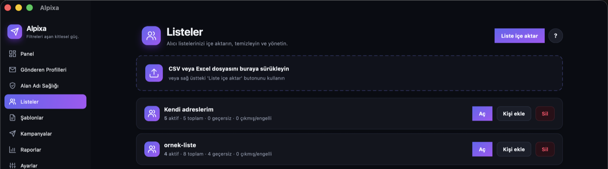

Büyük dosyalar satır satır okunur ve 5.000'lik gruplar halinde kaydedilir; 100.000 kişilik bir liste normal bir bilgisayarda birkaç saniyede içe aktarılır.

### 8.3 Otomatik temizlik

İçe aktarma sırasında uygulama şunları yapar:
- Hatalı yazılmış adresleri ayırır (Türkçe karakterli alan adları desteklenir)
- Tekrar eden adresleri atlar (büyük/küçük harf farkı önemsizdir)
- Alan adı e-posta alamayan adresleri (MX kontrolü) ayırır; bu kontrol isteğe bağlıdır
- Geçici (tek kullanımlık) adresleri ayırır
- `info@`, `admin@`, `noreply@` gibi genel adresleri işaretler (eklenir ama sonuçta sayısı gösterilir)
- Daha önce abonelikten çıkmış, ulaşmamış veya şikayet etmiş adresleri (bastırma listesi) göndermeye kapatır

Sonuç ekranında kaç adresin neden ayrıldığını görürsünüz.

### 8.4 Bastırma listesi

**Listeler** ekranının altındaki **Bastırma listesi**, bir daha asla e-posta gönderilmeyecek adresleri tutar: abonelikten çıkanlar, hard bounce olanlar, şikayet edenler ve üst üste 3 kez geçici hata (soft bounce) veren adresler. Buraya elle **Adres ekle** yapabilir, yanlışlıkla eklenmiş bir adresi **Listeden çıkar** ile geri alabilirsiniz.

---

## 9. İlk kampanya

**Kampanyalar → Yeni kampanya** (veya `Ctrl/Cmd + N`) sihirbazı:

| Adım | Açıklama |
|---|---|
| 1. Profil | Hangi hesaptan gönderileceği |
| 2. Liste | Hangi listeye gönderileceği. Sadece aktif kişilere gönderilir |
| 3. Şablon | Hazır şablonlardan seçin, kampanya adını ve konuyu yazın |
| 4. Kontroller | Alan adı sağlığı + içerik kontrolü + gönderilecek kişi sayısı + günlük sınır + **Test gönder** |
| 5. Mod ve zaman | Sıralı / Toplu, Şimdi / İleri bir tarihte, Deneme modu, Açılma takibi |
| 6. Onay | Özet ekranı, **Gönderimi başlat** |

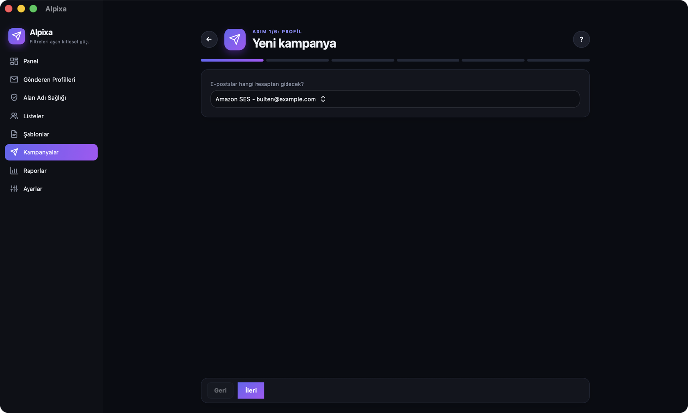

**Kontroller adımında:**
- Alan adında kırmızı madde varsa **İleri** çalışmaz. Önce düzeltmeniz önerilir; bilinçli olarak devam etmek için **Riskleri anlıyorum, yine de gönder** kutusunu işaretleyebilirsiniz.
- İçerikte kırmızı uyarı varsa (örnek link kısaltıcı, JavaScript, link metni ile adresin farklı olması) gönderim başlatılamaz; şablonu düzeltin.
- **Test gönder** ile kendi adreslerinize konusunun başında `[TEST]` olan bir kopya gider. Test adresleri kaydedilir; **Ayarlar → Test adresleri**'nden de değiştirebilirsiniz.

**Sıralı mi, toplu mu?**

| Mod | Ne zaman | Varsayılan davranış |
|---|---|---|
| Sıralı (varsayılan) | Yeni alan adı, küçük listeler, en güvenli seçim | Tek bağlantı, her e-posta arasında 3-8 saniye rastgele bekleme |
| Toplu | Alan adınız ısınmış, büyük listeler | 2 bağlantı (en fazla 5), hız sınırları içinde |

İki modda da her alıcıya **ayrı e-posta** gider; `Kime` alanında sadece o alıcı olur. Alıcılar birbirini görmez, BCC kullanılmaz.

**Deneme modu:** Gerçek gönderim yapmadan tüm akışı (kuyruk, kişiselleştirme, raporlama) çalıştırır. Günlük sınırdan ve ısınma planından düşmez.

**Gönderim sırasında:**
- Canlı ilerleme çubuğu, hız (e-posta/dk) ve tahmini bitiş süresi görünür.
- **Duraklat**, **Devam et** ve **İptal et** butonları vardır.
- Pencereyi küçültebilirsiniz; gönderim devam eder. Windows'ta sistem tepsisinde bir **A** simgesi belirir (üzerine gelince yüzde, tıklayınca pencere açılır); macOS'ta Dock simgesinde yüzde rozeti görünür. Kampanya bitince, durunca veya günlük sınır dolunca bildirim gelir.
- Bilgisayar gönderim bitene kadar uyku moduna geçmez.
- Uygulamayı kapatırsanız veya elektrik kesilirse, tekrar açtığınızda **kaldığı yerden otomatik devam eder**. Kimseye iki kez gönderilmez. Uygulama tam gönderim anında kapandıysa o tek e-postanın teslim durumu bilinemez; bu e-posta "Durumu bilinmiyor" olarak işaretlenir ve **tekrar gönderilmez**.
- İleri tarihli kampanyalar için uygulamanın o saatte **açık olması** gerekir. Uygulama kapalıysa, açıldığında zamanı geçmiş kampanya hemen başlar.

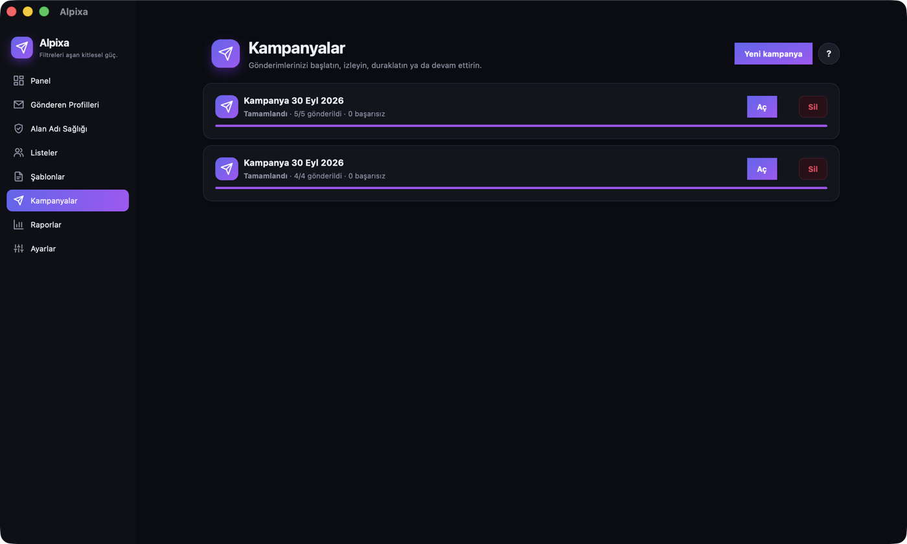

**Otomatik güvenlik durdurmaları.** Aşağıdaki durumlarda gönderim kendiliğinden durur ("Güvenlik için durduruldu") ve nedeni sade dille yazılır. Sorunu giderip **Devam et**'e basın.

| Durum | Eşik (varsayılan) |
|---|---|
| Hata oranı | Son 30 dakikada en az 50 gönderimin %5'inden fazlası başarısız |
| Hard bounce oranı | Kampanyada %5'i aşarsa (50 gönderimden sonra kontrol edilir) |
| Şikayet oranı | Kampanyada %0,3'u aşarsa |
| Giriş reddedildi | Sunucu kullanıcı adı/şifreyi kabul etmezse hemen |

Geçici hatalarda (`4xx`) e-posta 3 kez, artan bekleme süreleriyle (30 sn'den başlayarak) tekrar denenir. `421`/`450` gibi "yavaşla" cevapları gelirse uygulama hızı otomatik yarıya düşürür, sorun geçince tekrar arttırır. `550 5.1.1` gibi "adres yok" cevapları gelen adresler hemen bastırma listesine alınır.

**Şablonlar ve kişiselleştirme.** **Şablonlar** ekranında 4 hazır şablon vardır: Duyuru, Bülten, Davet, Sade mektup. **Kopyala** ile kopyalayıp **Düzenle**'yebilirsiniz. Düzenleme ekranında sağda masaüstü ve mobil genişlikte önizleme, altta içerik kontrolü görünür. Kullanılabilir alanlar:

| Alan | Değeri |
|---|---|
| `{{ ad }}`, `{{ soyad }}`, `{{ firma }}`, `{{ email }}` | Listeden |
| `{{ gonderen_adi }}`, `{{ gonderen_adres }}` | Profilden |
| `{{ unsubscribe_url }}` | Kişiye özel abonelikten çıkış linki |
| `{{ tarih }}`, `{{ ay }}`, `{{ kampanya }}`, `{{ konu }}` | Otomatik |
| `{{ kolon_adi }}` | Listedeki diğer kolonlar |

Boş alan için varsayılan değer: `{{ ad ?? "Değerli okurumuz" }}`.

Şablonda `{{ unsubscribe_url }}` yoksa Alpixa e-postanın altına gönderen adı, iletişim adresi ve **Abonelikten çık** linki içeren bir alt bilgi ekler. Her e-postanın HTML ve düz metin sürümü birlikte gönderilir (düz metin yazmazsanız otomatik üretilir). Örnek şablon: `samples/ornek-sablon.html`.

**Şablon düzenleyici.** Solda şablon adı, konu ve HTML içerik; sağda canlı önizleme vardır. Önizleme siz yazdıkça (yaklaşık yarım saniye sonra) kendiliğinden güncellenir; **Masaüstü** / **Mobil** düğmeleriyle 640 ve 375 piksel genişlik arasında geçiş yapabilirsiniz. Önizlemede örnek kişi olarak "Ayşe Yılmaz" kullanılır.

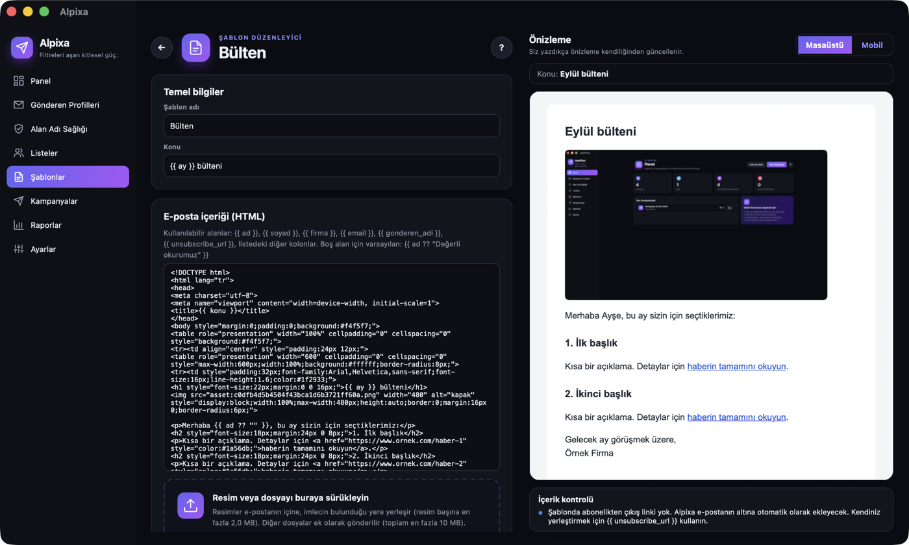

**Resim ekleme.** Resmi iki yoldan ekleyebilirsiniz:

1. Dosyayı Finder'dan / Dosya Gezgini'nden sürükleyip düzenleyicideki **Resim veya dosyayı buraya sürükleyin** alanına (veya HTML kutusunun bulunduğu karta) bırakın.
2. **Resim ekle** butonuna basıp dosyayı seçin.

Resim, HTML kutusunda imlecin bulunduğu yere eklenir. İmleç yoksa ilk başlığın (`</h1>`) ya da ilk paragrafın hemen altına eklenir. Eklenen kod şuna benzer:

```html

```

- Genişlik resmin gerçek genişliğinden alınır, en fazla 536 pikseldir (600 piksellik e-posta gövdesine sığar); telefonda otomatik küçülür.
- `alt` metni dosya adından üretilir (`kapak-resmi.png` → "kapak resmi"). Resim yüklenmediğinde okuyucu bu metni görür; gerekirse HTML'de değiştirin.
- Desteklenen biçimler: PNG, JPG, GIF, WEBP. Resim başına sınır varsayılan **2 MB**'dir.
- Gönderimde resimler e-postanın içine gömülür (`cid:` ile, "inline" ek olarak). Alıcının "resimleri göster" demesine gerek kalmaz ve dış bir sunucuya bağlantı kurulmaz.

**Dosya eki ekleme.** PDF, Excel, CSV gibi resim olmayan dosyaları aynı alana sürükleyin ya da **Dosya ekle** ile seçin (birden fazla dosya seçilebilir). Ekler şablonun altındaki **Ekler** kartında listelenir; her birinin boyutu ve **Kaldır** butonu vardır. Kartın üstündeki çubuk, toplam boyutun sınıra ne kadar yaklaştığını gösterir (%80'i geçince turuncuya döner).

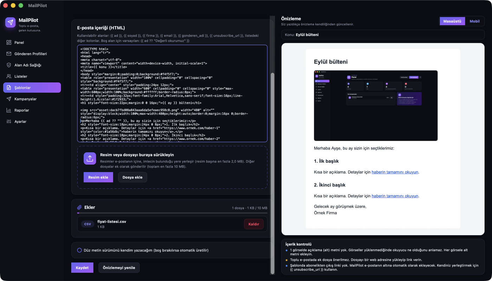

- Bir şablondaki eklerin **toplam** boyutu varsayılan olarak en fazla **10 MB** olabilir. Sınırı aşan dosya eklenmez ve ne kadar yer kaldığı yazılır.
- Yeni (henüz kaydedilmemiş) bir şablona ilk ek eklendiğinde şablon otomatik kaydedilir.
- Şablonu **Kopyala** ile çoğaltırsanız ekler de kopyalanır.
- Kampanya sihirbazında **Kontroller** adımına geçildiğinde şablonun o anki ekleri kampanyaya sabitlenir; sonradan şablonda yaptığınız ek değişiklikleri devam eden kampanyayı etkilemez.
- İçerik kontrolü, toplu e-postada ek olduğunu turuncu uyarıyla hatırlatır: ekler spam puanını ve e-posta boyutunu artırır. Büyük dosyaları mümkünse bir web adresine yükleyip link verin.

Sınırları **Ayarlar → Gelişmiş ayarları göster → Gönderim hızı** bölümünden değiştirebilirsiniz: **Ek sınırı (MB, şablon başına toplam)** 1–25 arası, **Resim sınırı (KB, resim başına)** 50–5120 arası. Birçok e-posta sağlayıcısı 20–25 MB'ın üzerindeki e-postaları reddeder; sınırı bunun altında tutun.

Resimler ve ekler veri klasöründeki `files/` alt klasöründe saklanır ve **Yedek al** ile alınan yedeğe dahil edilir.

---

## 10. Isınma planı

Yeni bir alan adından birden binlerce e-posta göndermek spam filtrelerini tetikler. Hacmi yavaş yavaş artırmak gerekir. Alpixa bunu varsayılan olarak otomatik yapar (profilde **Isınma planı açık (önerilir)**).

| Gün | Günlük gönderim |
|---|---|
| 1-2 | 50 |
| 3-4 | 100 |
| 5-6 | 250 |
| 7-8 | 500 |
| 9-10 | 1.000 |
| 11-14 | 2.500 |
| 15+ | Her gün %20 artış (15. gün 3.000, 16. gün 3.600 ...) |

- Gün sayımı, o profilden yapılan ilk gerçek gönderimle başlar.
- Profilin **Günlük** sınırı ile ısınma planı sınırından hangisi küçükse o uygulanır.
- Günlük sınır dolunca kampanya "Yarını bekliyor (günlük sınır)" durumuna geçer ve ertesi gün gece yarısından sonra otomatik devam eder (uygulama açık olmalı).
- Kampanya sihirbazının **Kontroller** adımında tahmini kaç gün süreceği yazar.
- Planı **Ayarlar → Gelişmiş ayarları göster → Isınma planı** bölümünden değiştirebilirsiniz (her satır `gun: gunluk sinir`). **Varsayılan plana dön** butonu varsayılanı geri getirir.

İpuçları:
- İlk günlerde en ilgili ve en güncel kişilere gönderin.
- Bounce oranı %2'yi veya şikayet oranı %0,1'i geçerse artışı durdurun. **Panel** ve **Raporlar** ekranları sizi uyarır; üst sınırlar (%5 / %0,3) aşılırsa gönderim otomatik durur.

Listeniz 10.000 kişi ise, hepsine ulaşmak iki haftaya yakın sürer. Bu normaldir ve uzun vadede çok daha iyi sonuç verir.

---

## 11. Spama düşmemek için kontrol listesi

### Yapın

- [ ] SPF, DKIM ve DMARC kayıtları eklendi ve **Alan Adı Sağlığı**'nda yeşil
- [ ] Toplu gönderim için ayrı alt alan adı kullanılıyor
- [ ] Listedeki herkesin izni var
- [ ] Liste son 6-12 ay içinde güncellendi
- [ ] Isınma planı açık
- [ ] Her e-postada görünür abonelikten çıkış linki var (Alpixa otomatik ekler)
- [ ] Gönderen adı ve adresi tutarlı ve tanıdık
- [ ] Konu satırı açık ve dürüst
- [ ] Metin ve görsel dengeli, görsellerde açıklama (alt) metni var
- [ ] Önce kendinize **Test gönder** ile deneme yaptınız
- [ ] Gmail/Yahoo tek tıkla çıkış için abonelikten çıkış sunucusu kuruldu ([Bölüm 16.6](#166-abonelikten-çıkış-sunucusu-isteğe-bağlı))

### Yapmayın

- [ ] Satın alınmış liste kullanmak
- [ ] BCC ile toplu gönderim (Alpixa zaten yapmaz)
- [ ] URL kısaltıcı (bit.ly vb.) — Alpixa engeller
- [ ] Sadece tek görselden oluşan e-posta — Alpixa uyarır
- [ ] Büyük ek dosyalar (link ile paylaşın)
- [ ] TAMAMI BÜYÜK HARF konu, aşırı ünlem!!! — Alpixa uyarır
- [ ] Abonelikten çıkışı gizlemek veya zorlaştırmak
- [ ] Isınma yapmadan yüksek hacim
- [ ] Kişisel Gmail/Outlook hesabından toplu gönderim

Alpixa'nın içerik kontrolü ayrıca şunları denetler: HTML boyutu 100 KB üstü (Gmail kırpar), link metninde yazan adres ile gerçek adresin farklı olması, JavaScript, form alanları, gömülü video/iframe ve yaygın spam ifadeleri.

---

## 12. Kurulum sonrası izleme

Gönderim yapmaya başladıktan sonra itibarınızı düzenli takip edin.

| Araç | Ne gösterir | Adres |
|---|---|---|
| Google Postmaster Tools | Gmail'in alan adınıza bakışı, spam oranı | https://postmaster.google.com |
| Microsoft SNDS | Outlook/Hotmail tarafında IP itibarı (kendi IP'niz varsa) | https://sendersupport.olc.protection.outlook.com/snds/ |
| MXToolbox | DNS ve kara liste kontrolü | https://mxtoolbox.com |
| mail-tester | Tek e-postanın spam puanı | https://www.mail-tester.com |
| DMARC raporları | Alan adınız adına kimin gönderdiği | DMARC kaydındaki `rua` adresi |
| Alpixa Raporlar | Gönderim, bounce, çıkış, şikayet, açılma | Uygulama içinde |

**Raporlar** ekranında her kampanya için toplam, gönderilen, başarısız, bounce %, şikayet %, çıkan ve açılma sayısı görünür. Oranlar hedefin altındaysa yeşil, hedefi aşınca sarı, üst sınırı aşınca kırmızı olur. Kampanya sonuçlarını **CSV** veya **Excel** olarak dışa aktarabilir, **Kişi bazında gönderim geçmişi** kutusundan bir adrese hangi kampanyaların gittiğini görebilirsiniz.

### Hedef değerler

| Metrik | Hedef | Üst sınır |
|---|---|---|
| Şikayet (spam işaretleme) oranı | < %0,1 | %0,3 |
| Hard bounce oranı | < %2 | %5 |
| Abonelikten çıkış işleme süresi | Anında | 2 gün |

Alpixa üst sınırlar aşılırsa gönderimi otomatik duraklatır ve sizi uyarır. Abonelikten çıkış istekleri IMAP ve abonelikten çıkış sunucusu üzerinden her 15 dakikada bir işlenir.

---

## 13. Sık sorulan sorular

**Kaç kişiye gönderebilirim?**
Uygulamada sınır yok. Sınır, gönderim hesabınızın limiti, profildeki günlük sınır ve ısınma planıdır.

**E-postalarım neden hemen gitmiyor?**
Uygulama bilerek yavaş gönderir. Sıralı modda her e-posta arasında 3-8 saniye beklenir; ayrıca dakikalık, saatlik ve alıcı sağlayıcısına göre (Gmail 20/dk, Outlook/Hotmail 20/dk, Yahoo 15/dk, Yandex 15/dk, diğer 30/dk) sınırlar vardır. Hızlı gönderim spam filtrelerini tetikler.

**Bilgisayarı kapatırsam ne olur?**
Gönderim durur. Tekrar açınca kaldığı yerden devam eder.

**Aynı kişiye iki kez gider mi?**
Hayır. Her gönderim kaydedilir; aynı kampanyada her kişi için tek kayıt vardır.

**Gmail hesabımla kullanabilir miyim?**
Teknik olarak evet (uygulama şifresi veya tarayıcı ile giriş), ama günde birkaç yüzden fazla gönderim için önerilmez.

**Verilerim nerede?**
Sadece kendi bilgisayarınızda, yerel bir veritabanı dosyasında (`alpixa.db`). Hiçbir sunucuya yüklenmez (seçtiğiniz gönderim sağlayıcısı ve kurarsanız kendi abonelikten çıkış sunucunuz hariç). Tam yol: **Ayarlar → Veri ve destek → Veri klasörü**.

**Açılma takibi var mi?**
Var, ama varsayılan kapalı. Kampanya sihirbazının 5. adımında açabilirsiniz; varsayılan olarak açık olmasını isterseniz **Ayarlar → Yeni kampanyalarda açılma takibi açık olsun** (gizlilik uyarısı gösterilir). Çalışması için abonelikten çıkış sunucusu gerekir.

**Windows ve Mac arasında verilerimi taşıyabilir miyim?**
Evet. **Ayarlar → Yedek al** ile yedekleyin, diğer bilgisayarda **Ayarlar → Yedekten yükle** ile yükleyin ve Alpixa'yı kapatıp açın. Şifreler yedeğe dahil edilmez; profillerde yeniden girmeniz gerekir.

**IYS kontrolü yapıyor mu?**
Bu sürümde hayır. Kodda IYS gibi bir izin sistemine bağlanmak için `IConsentProvider` bağlantı noktası vardır; bir geliştirici bunu uygulayınca her alıcı gönderimden önce kontrol edilir ve izni olmayanlar atlanır. **Ayarlar → KVKK / GDPR** bölümünde "IYS entegrasyonu" satırı durumu gösterir.

**Bir kişi verilerinin silinmesini isterse (KVKK / GDPR)?**
**Ayarlar → KVKK / GDPR** bölümüne adresi yazın. **Verilerini dışa aktar** kişiye ait tüm kayıtları JSON dosyası olarak verir; **Kişiyi sil** kişiyi tüm listelerden ve olay kayıtlarından siler. Kişi bastırma listesindeyse orada kalır; böylece tekrar e-posta almaz.

**Arayüz İngilizce olabilir mi?**
Evet. **Ayarlar → Dil** menüsünden Türkçe, English, Deutsch, Français, Español veya Русский seçip uygulamayı kapatıp açın. Menüler, bilgi kartları, alan adı kontrolü ve içerik kontrolü sonuçları, hata mesajları, rapor dosyalarının sütun başlıkları ve e-postaların altındaki abonelikten çıkış metni seçilen dilde olur. Hazır şablonların içeriği Türkçedir; kendi şablonlarınızı istediğiniz dilde yazabilirsiniz.

---

## 14. Sorun giderme

| Belirti | Olası neden | Çözüm |
|---|---|---|
| Tüm e-postalar spama düşüyor | SPF/DKIM/DMARC eksik | **Alan Adı Sağlığı** ekranını kontrol edin |
| Sadece Gmail'de spam | Düşük itibar, yüksek şikayet | Postmaster Tools'a bakın, hacmi düşürün, listeyi temizleyin |
| "Sunucuya bağlanılamadı" | Yanlış sunucu/port veya güvenlik duvarı | Ayarları kontrol edin, port 587'nin açık olduğundan emin olun |
| "Sunucu adresi bulunamadı" | Sunucu adresinde yazım hatası | Adresi ve internet bağlantınızı kontrol edin |
| "Güvenli bağlantı kurulamadı" | Port ile güvenlik ayarı uyumsuz, ya da ağınızdaki bir antivirüs/proxy bağlantıyı araya girip değiştiriyor | 587 için `StartTls`, 465 için `SslOnConnect` seçin. Ayrıntı **Ayarlar → Log klasörünü aç** altındaki günlük dosyasında yazar. (Not: Sertifika iptal durumu öğrenilemediğinde bağlantı artık reddedilmez; önceki sürümde Gmail bu yüzden bağlanamıyordu.) |
| "Gmail şifreniz kabul edilmedi" | Normal Gmail şifresi girilmis | Uygulama şifresi oluşturun ([Bölüm 7.1](#71-gmail--google-workspace)) |
| "Kullanıcı adı veya şifre kabul edilmedi" | Yanlış bilgi, ESP'de hesap şifresi girilmis | ESP panelinden aldığınız SMTP bilgilerini girin |
| "Bu kurulumda tarayıcı ile giriş (OAuth) ayarlanmamış" | appsettings.json'da istemci kimliği yok | Uygulama şifresi kullanın veya [Bölüm 16.7](#167-oauth-istemci-kimlikleri-gmail-ve-microsoft-365) |
| "Hesabınız için tekrar giriş yapmanız gerekiyor" | Google/Microsoft oturumu sona ermis | Profili açıp **Tarayıcı ile giriş yap** |
| Gönderim kendiliğinden durdu ("Güvenlik için durduruldu") | Hata, bounce veya şikayet eşiği aşıldı | Kampanya ekranındaki nedeni okuyun, **Raporlar**'da hataları inceleyin, **Devam et** |
| Kampanya "Yarını bekliyor" | Günlük sınır veya ısınma planı doldu | Normaldir. Ertesi gün otomatik devam eder (uygulama açık olmalı) |
| Çok yavaş gidiyor | Isınma planı veya hız sınırları | Normaldir. Alan adı ısındıkça hızlanır |
| `421` / `450` hataları | Sağlayıcı hızınızı sınırlıyor | Uygulama hızı otomatik düşürür. Beklemek yeterli |
| `550 5.7.x` hataları | Kimlik doğrulama veya kara liste | **Alan Adı Sağlığı**'nda DNS ve kara liste kontrolü |
| Yüksek bounce | Eski liste | Listeyi yeniden doğrulayın, MX kontrolü ile tekrar içe aktarın |
| "Durumu bilinmiyor" e-postalar | Uygulama tam gönderim anında kapandı | Bu e-postalar bilerek tekrar gönderilmez |
| Microsoft 365 bağlanamıyor | Şifreyle giriş kapalı | **Tarayıcı ile giriş yap** seçeneğini kullanın |
| macOS "uygulama açılamıyor" | Güvenlik ayarı | Sistem Ayarları → Gizlilik ve Güvenlik → Yine de Aç |
| Windows "Bilinmeyen yayıncı" | İmzasız sürüm | Ek bilgi → Yine de çalıştır |

Sorun devam ederse: **Ayarlar → Destek paketi oluştur**. Şifre, token, alıcı adresi veya e-posta içeriği içermeyen bir zip dosyası oluşur (son 7 günün logları ve ayarlar). Bunu destek ekibine iletin. Loglara **Ayarlar → Log klasörünü aç** ile ulaşabilirsiniz; log dosyaları günlük oluşturulur ve 30 gün saklanır.

---

## 15. Sözlük

| Terim | Anlamı |
|---|---|
| **SPF** | Alan adınız adına hangi sunucuların e-posta gönderebileceğini söyleyen DNS kaydı |
| **DKIM** | E-postaya eklenen dijital imza. Değiştirilmediğini kanıtlar |
| **DMARC** | SPF/DKIM başarısız olursa ne yapılacağını söyleyen kural |
| **Hizalama (alignment)** | Gönderen adresindeki alan adı ile SPF/DKIM'in doğruladığı alan adının uyumlu olması |
| **DNS** | Alan adınızın ayarlarının tutulduğu sistem |
| **MX** | Bir alan adının e-posta alan sunucusunu gösteren DNS kaydı |
| **PTR (ters DNS)** | Bir IP adresinin hangi sunucu adına ait olduğunu gösteren kayıt |
| **ESP** | E-posta Servis Sağlayıcısı. Toplu gönderim için uzmanlaşmış firma (Amazon SES, Brevo vb.) |
| **SMTP** | E-posta göndermek için kullanılan protokol |
| **IMAP** | E-posta okumak için kullanılan protokol |
| **OAuth** | Şifre yerine tarayıcıda giriş yapıp izin vererek bağlanma yöntemi |
| **Bounce** | Alıcıya ulaşmayan, geri dönen e-posta. Hard (kalıcı) ve soft (geçici) olarak ikiye ayrılır |
| **Isınma (warm-up)** | Yeni alan adıyla gönderim hacmini kademeli artırma |
| **Bastırma listesi** | Bir daha asla e-posta gönderilmeyecek adresler |
| **Şikayet oranı** | Alıcıların "spam" olarak işaretlediği e-postaların oranı |
| **Kara liste (DNSBL)** | Spam gönderdiği düşünülen IP/alan adlarının listesi |
| **Tek tıkla abonelikten çıkış** | Gmail/Yahoo'nun e-postanın üstünde gösterdiği "Abonelikten çık" butonu (RFC 8058) |
| **IYS** | Türkiye'de ticari ileti izinlerinin tutulduğu resmi sistem |

---

## 16. Geliştiriciler için

### 16.1 Gereksinimler

| Araç | Açıklama |
|---|---|
| .NET 10 SDK | https://dotnet.microsoft.com/download |
| .NET MAUI workload | `dotnet workload install maui` (sadece Mac: `dotnet workload install maui-maccatalyst` yeterli) |
| Visual Studio 2026 (Windows) | ".NET Multi-platform App UI development" is yükü |
| Mac + Xcode (macOS derlemesi için) | Apple kuralı gereği macOS paketi sadece Mac'te derlenip imzalanır |
| Apple Developer Program üyeliği | macOS paketini imzalamak ve notarize etmek için |
| Inno Setup 6 (Windows paketi için) | `winget install JRSoftware.InnoSetup` |
| Git | Kaynak kod yönetimi |

Masaüstü uygulama projesi Windows'ta sadece Windows hedefini, macOS'ta sadece Mac Catalyst hedefini derler.

### 16.2 Çalıştırma

Windows (PowerShell):

```powershell
git clone <repo-adresi> Alpixa
cd Alpixa
dotnet build src/Alpixa.App -f net10.0-windows10.0.19041.0 -t:Build,Run
```

macOS:

```bash
git clone <repo-adresi> Alpixa
cd Alpixa
dotnet build src/Alpixa.App -f net10.0-maccatalyst -t:Build,Run
```

`-t:Run` tek başına kodu yeniden derlemez, sadece son derlenen uygulamayı açar; bu yüzden `-t:Build,Run` kullanın.

macOS'ta Xcode 27 veya üstü gerekir. Xcode'u kurduktan sonra bir kez seçin (yönetici şifresi ister):

```bash
sudo xcode-select -s /Applications/Xcode.app
```

Geliştirme (Debug) derlemesi sandbox ve Anahtar Zinciri erişim grubu olmadan imzalanır (`Platforms/MacCatalyst/Entitlements.Debug.plist`), çünkü bu yetki provisioning profile olmadan uygulamanın açılmasını engeller. Release derlemesi `Entitlements.plist` kullanır. Provisioning profile olmadan Anahtar Zinciri API'si kullanılamadığı için geliştirme derlemesi şifreleri macOS'un `security` aracı ile aynı giriş Anahtar Zinciri'ne yazar (şifre komut satırında değil, standart girdiden aktarılır).

Veya Visual Studio'da `Alpixa.sln` çözümünü açıp **Alpixa.App**'i başlangıç projesi yapın ve **F5**.

Veritabanı ilk çalıştırmada otomatik oluşur ve EF Core migration'lari otomatik uygulanır. Ek yapılandırma gerekmez.

Xcode'u olmayan bir Mac'te veya CI'da arayüz kodunun (tüm ViewModel'ler ve XAML) derlendiğini doğrulamak için:

```bash
dotnet build src/Alpixa.App -p:AlpixaVerifyBuild=true
```

Bu komut uygulamayı platformdan bağımsız `net10.0` hedefiyle derler (çalıştırılabilir uygulama üretmez).

### 16.3 Test

```bash
dotnet test tests/Alpixa.Tests
```

Testler (xUnit + FluentAssertions 7) şunları kapsar:
- Birim: hız sınırlayıcı (token bucket), domain karıştırma, ısınma planı, adres doğrulama (IDN dahil), SPF/DMARC/DKIM ayrıştırma, SMTP cevap sınıflandırma, DSN/ARF/abonelikten çıkış ayrıştırma, içerik denetleyici, şablon, mesaj başlıkları (`List-Unsubscribe`, `List-Unsubscribe-Post`, `Message-ID`, `Feedback-ID`, tek `To`, `multipart/alternative`), alan adı sağlığı (sahte DNS ile)
- Gönderim motoru: sıralı/toplu mod, tekrar deneme, devre kesici, kalıcı hata → bastırma, günlük kota/ısınma → ertesi gün devam, deneme modu, duraklat/devam et, **uygulama kapanıp açıldığında kaldığı yerden devam ve iki kez göndermeme**, zamanlayıcı
- Entegrasyon: test içinde çalışan yerel bir SMTP sunucusu ile gerçek SMTP protokolü üzerinden uçtan uca gönderim, bağlantı testi, test gönderimi; abonelikten çıkış sunucusu senkronizasyonu; yedek ve destek paketi; `samples/` dosyaları
- Performans: 100.000 kayıtlık listenin içe aktarılması ve kuyruğa alınması

Sadece hızlı testler için: `dotnet test tests/Alpixa.Tests --filter "Category!=Performance"`.

Uygulamayı gerçek bir yerel test SMTP sunucusuyla (smtp4dev veya Papercut) elle denemek için sunucuyu `localhost:2525`'te başlatın ve Alpixa'da sağlayıcı olarak **Yerel test sunucusu (smtp4dev / Papercut)** seçerek profil ekleyin. Bu profilde alan adı kontrolleri atlanır.

### 16.4 Kurulum paketi üretme

**Otomatik (önerilen):** `.github/workflows/release.yml` iki kurulum dosyasını da GitHub'ın sunucularında üretir; kendi bilgisayarınızda Windows veya Xcode gerekmez.

- Deneme derlemesi: GitHub'da **Actions → Build installers → Run workflow**. Bitince dosyalar çalıştırmanın sayfasında **Artifacts** altında olur.
- Yayınlama: yeni bir sürüm etiketi gönderin; dosyalar otomatik olarak **Releases** sayfasına eklenir.

```bash
git tag v1.0.0
git push origin v1.0.0
```

Bu yolla üretilen paketler imzasızdır (bkz. [4. Kurulum](#4-kurulum)). İmzalı paket için aşağıdaki betikleri sertifikalarınızla kendi bilgisayarınızda çalıştırın.

**Elle:**

Windows (`artifacts/AlpixaSetup.exe`, self-contained; Windows'ta çalıştırın):

```powershell
./build/build-windows.ps1
```

İsteğe bağlı imzalama için `WINDOWS_SIGN_CERT` (.pfx yolu) ve `WINDOWS_SIGN_PASSWORD` ortam değişkenlerini tanımlayın.

macOS (imzalı ve notarize edilmiş `artifacts/Alpixa.dmg`; Mac'te çalıştırın):

```bash
export APPLE_SIGNING_IDENTITY="Developer ID Application: Firma Adı (TEAMID)"
export APPLE_TEAM_ID="TEAMID"
export APPLE_ID="gelistirici@firma.com"
export APPLE_APP_PASSWORD="xxxx-xxxx-xxxx-xxxx"
./build/build-macos.sh
```

Sadece kendi Mac'inizde denemek için imzasız paket: `./build/build-macos.sh --unsigned`. Keychain erişimi (şifre saklama) için Developer ID provisioning profile gerekiyorsa adını `APPLE_PROVISIONING_PROFILE` ile verin.

Paketler `artifacts/` klasörüne yazılır. Son kullanıcının .NET kurmasına gerek yoktur.

### 16.5 Proje yapısı

```
Alpixa.sln
 ├─ src/Alpixa.App                  Masaüstü arayüz (MAUI, MVVM), Controls/ (tasarım bileşenleri), Platforms/Windows, Platforms/MacCatalyst
 ├─ src/Alpixa.Core                 Modeller, arayüzler, iş kuralları (doğrulama, DNS ayrıştırma, içerik denetleyici)
 ├─ src/Alpixa.Infrastructure       EF Core + SQLite, SMTP/IMAP (MailKit), DNS, içe aktarma, OAuth, raporlar, resim/ek deposu
 ├─ src/Alpixa.Sending              Kuyruk, hız sınırlama, ısınma, gönderim motoru (Polly), zamanlayıcı
 ├─ src/Alpixa.UnsubscribeEndpoint  İsteğe bağlı tek tıkla abonelikten çıkış sunucusu (ASP.NET Core Minimal API)
 ├─ tests/Alpixa.Tests              Testler
 ├─ build/                             Paketleme scriptleri (build-windows.ps1, Alpixa.iss, build-macos.sh)
 ├─ samples/                           ornek-liste.csv, ornek-sablon.html, dns-kayitlari.txt, appsettings.json
 └─ docs/                              README ekran görüntüsü yer tutucuları
```

Veritabanı şeması değişirse yeni migration:

```bash
dotnet tool restore
dotnet ef migrations add <Ad> --project src/Alpixa.Infrastructure --output-dir Data/Migrations
```

### 16.6 Abonelikten çıkış sunucusu (isteğe bağlı)

Gmail ve Yahoo toplu göndericilerden HTTPS üzerinden tek tıkla abonelikten çıkış (RFC 8058) bekler. ESP'nizin kendi abonelikten çıkış altyapısı yoksa veya özel SMTP kullanıyorsanız `src/Alpixa.UnsubscribeEndpoint` projesini HTTPS arkasında (örnek bir reverse proxy ile) yayınlayın.

1. Alpixa'da **Ayarlar → Gizli anahtarı kopyala** ile gizli anahtarı alın.
2. Kendiniz uzun, rastgele bir API anahtarı belirleyin.
3. Sunucuyu çalıştırın:

```bash
Alpixa__Secret="<kopyalanan gizli anahtar>" Alpixa__ApiKey="<api anahtarı>" Alpixa__SenderName="Firmanız" \
  dotnet run --project src/Alpixa.UnsubscribeEndpoint --urls http://127.0.0.1:5099
```

4. Alpixa'da **Ayarlar → Abonelikten çıkış sunucusu** bölümüne sunucunun `https://` adresini ve API anahtarını girip **Kaydet**.

Bundan sonra her e-postada `List-Unsubscribe` başlığına HTTPS adresi ve `List-Unsubscribe-Post: List-Unsubscribe=One-Click` eklenir; e-posta içindeki link de bu adrese gider. Sunucu adresleri açık metin tutmaz (link içindeki kimlik şifrelidir). Alpixa, çıkışları ve (açıldıysa) açılma olaylarını her 15 dakikada bir `GET /api/events` ile çeker. Üç noktalar: `GET/POST /u/{token}` (çıkış sayfası ve tek tık), `GET /o/{token}.gif` (açılma pikseli), `GET /api/events?after=<id>` (`X-Api-Key` başlığı gerekir).

Sunucu tanımlı değilse `List-Unsubscribe` başlığında sadece `mailto:` adresi olur; bu istekler IMAP ile okunur ([Bölüm 7.5](#75-bounce-takibi-için-imap-önerilir)).

### 16.7 OAuth istemci kimlikleri (Gmail ve Microsoft 365)

**Tarayıcı ile giriş yap** butonunun çalışması için bir kez istemci kimliği tanımlamanız gerekir. Kişisel kullanımda daha kolay yol, profilde **uygulama şifresi** kullanmaktır ([Bölüm 7.1](#71-gmail--google-workspace)).

**Google (Gmail) — adım adım:**

1. https://console.cloud.google.com adresine Gmail hesabınızla girin. Üstteki proje seçiciden **Yeni proje** oluşturun (ad: `Alpixa`).
2. **APIs & Services → Library** içinde **Gmail API**'yi bulup **Enable** deyin.
3. **APIs & Services → OAuth consent screen** (yeni arayüzde **Google Auth Platform → Branding / Audience**):
   - Uygulama adı: `Alpixa`, destek e-postası: kendi adresiniz.
   - **Audience / User type: External**. Yayın durumu **Testing** kalsın.
   - **Test users** bölümüne giriş yapacağınız Gmail adres(ler)ini ekleyin. Listede olmayan hesaplar giriş yapamaz.
   - **Data access / Scopes** bölümüne `https://mail.google.com/` kapsamını ekleyin.
4. **APIs & Services → Credentials → Create credentials → OAuth client ID**, uygulama türü **Desktop app**, ad: `Alpixa`. **Create** deyin.
5. Açılan pencerede **Client ID** (`...apps.googleusercontent.com` ile biter) ve **Client secret** (`GOCSPX-` ile başlar) değerlerini kopyalayın.
6. Alpixa'da **Ayarlar → Tarayıcı ile giriş (Google / Microsoft)** bölümüne bu iki değeri yapıştırıp **Kaydet**'e basın. Yeniden başlatmaya gerek yoktur.
7. **Gönderen Profilleri → Düzenle** (sağlayıcı: Gmail) → **Uygulama şifresi kullan** işaretini kaldırın → **Tarayıcı ile giriş yap**. Tarayıcıda hesabı seçin; "Google bu uygulamayı doğrulamadı" uyarısında **Devam**'a basın (uygulama sizin projeniz olduğu için güvenlidir) ve izin verin. Tarayıcıda "Giriş tamamlandı" yazınca Alpixa'ya dönün.

Notlar:
- Alpixa, yönlendirme için `127.0.0.1` üzerinde geçici bir port açar (loopback + PKCE). Masaüstü istemcilerinde ayrıca yönlendirme adresi tanımlamanız gerekmez.
- Masaüstü uygulamalarında "Client secret" gerçek bir sır değildir (Google da böyle belgeler), ancak yine de paylaşmayın.
- Yayın durumu **Testing** iken Google, Gmail izninin (refresh token) **7 günde bir** yenilenmesini ister; süre dolunca profilde **Tarayıcı ile giriş yap**'a tekrar basmanız yeterlidir. Uygulamayı **Production**'a almak `https://mail.google.com/` gibi kısıtlı kapsamlar için Google'ın güvenlik incelemesini gerektirir; kişisel kullanım için gerekmez.

**Microsoft 365:** Entra ID → App registrations → New registration → "Public client/native", yönlendirme adresi `http://localhost`. API izinleri: Office 365 Exchange Online → `SMTP.Send` ve `IMAP.AccessAsUser.All` (delegated). **Application (client) ID** değerini **Ayarlar → Tarayıcı ile giriş** bölümüne girin. Kişisel Outlook.com/Hotmail hesapları için SMTP AUTH artık desteklenmiyor olabilir; bu durumda tarayıcı ile giriş gerekir.

Ayarlar ekranı değerleri veri klasöründeki `appsettings.json` dosyasına yazar. Dağıtım yapan biri isterseniz değerleri derlemeden önce `src/Alpixa.App/appsettings.json` dosyasına da koyabilir (uygulamaya gömülür); veri klasöründeki dosya gömülü ayarların yerine geçer. Örnek: `samples/appsettings.json`.

Aynı dosyada `HelpBaseUrl` değerini kendi README adresinize ayarlayın; **?** yardım pencerelerindeki "Kullanım kılavuzunu aç" butonu bu adresi kullanır.

### 16.8 Veri konumları

| Platform | Klasör |
|---|---|
| Windows | `%LOCALAPPDATA%` altındaki Alpixa uygulama veri klasörü |
| macOS | İmzalı dağıtım paketi: `~/Library/Containers/com.alpixa.app/` altında (sandbox). Geliştirme derlemesi: `~/Library/Alpixa/` |

Tam yol her zaman **Ayarlar → Veri ve destek → Veri klasörü** satırında yazar. İçerik: `alpixa.db` (SQLite), `logs/` (günlük log dosyaları, 30 gün), `files/` (şablonlara eklenen resimler ve dosyalar). Şifreler bu klasörde değil, işletim sisteminin güvenli deposundadır.

### 16.9 Kullanılan teknolojiler

.NET 10, C#, .NET MAUI + CommunityToolkit.Mvvm / CommunityToolkit.Maui, MailKit / MimeKit (SMTP, IMAP, MIME, DKIM), EF Core + SQLite, DnsClient.NET, CsvHelper, ClosedXML, Scriban, Polly, Serilog, Microsoft.Identity.Client (MSAL), MAUI SecureStorage, H.NotifyIcon (Windows sistem tepsisi), xUnit + FluentAssertions.

Promptta Google girişi için MAUI `WebAuthenticator` önerilmişti; `WebAuthenticator` Windows masaüstünde desteklenmediği için Google girişi her iki platformda da aynı şekilde çalışan sistem tarayıcısı + loopback (RFC 8252) yöntemiyle yapılır.

### 16.10 Doğrulama durumu

Bu sürüm bir macOS makinede (Xcode 27) Windows olmadan geliştirildi. Durum:

| Konu | Durum |
|---|---|
| Core, Infrastructure, Sending, UnsubscribeEndpoint derlemesi | Derlendi |
| `dotnet test tests/Alpixa.Tests` | 113 testin tamamı geçti |
| Arayüz (tüm XAML ve ViewModel'ler) | `-p:AlpixaVerifyBuild=true` ile derlendi |
| Windows ve Mac Catalyst platform kodu | Gerçek Windows App SDK / Mac Catalyst referanslarina karşı tip kontrolunden geçti |
| Abonelikten çıkış sunucusu | Yerelde çalıştırılıp curl ile denendi |
| Mac Catalyst uygulamasının derlenmesi ve açılması | Derlendi ve açıldı; Panel ekranı görüntüyle kontrol edildi, veritabanı ve log oluştu, hazır şablonlar yüklendi |
| Arayüzün ekran ekran denenmesi (Mac) | Tüm ekranlar fare ve klavye ile denendi: profil ekleme, bağlantı testi, alan adı kontrolü (gerçek DNS), dosya ve yapıştırma ile liste içe aktarma, şablon önizleme ve içerik kontrolü, test gönderimi, kampanya gönderimi (yerel test sunucusuna), raporlar ve CSV, KVKK dışa aktarma, yedek ve destek paketi. Yeni tasarımdan sonra tüm ekranlar koyu ve açık temada yeniden kontrol edildi; sihirbaz adım geçişleri ve adım çubuğu görüntüyle doğrulandı |
| Şablona resim ve ek ekleme (Mac) | **Resim ekle** ve **Dosya ekle** ile, ayrıca Finder'dan gerçek sürükle-bırak ile denendi. Resim imlecin olduğu yere eklendi, önizlemede göründü; 11 MB'lık dosya 10 MB sınırı nedeniyle Türkçe bir uyarıyla reddedildi. Yerel test sunucusuna giden e-postada resim `multipart/related` içinde `cid:` ile gömülü, CSV ise ek olarak geldi |
| `build-macos.sh` ile imzalı DMG | **Denenmedi** (Developer ID sertifikası gerekli) |
| Windows uygulamasının çalıştırılması, `build-windows.ps1` ile kurulum dosyası | **Denenmedi** (Windows gerekli) |
| Gmail / Microsoft 365 OAuth akışı | **Denenmedi** (istemci kimliği gerekli) |

İlk gerçek Windows derlemesinden sonra sistem tepsisi, bildirimler, sürükle-bırak ve pencere boyutu hatırlama davranışlarını elle kontrol edin.

---

## Lisans ve sorumluluk

Gönderilen içeriklerin ve alıcı izinlerinin yasal sorumluluğu kullanıcıya aittir.
